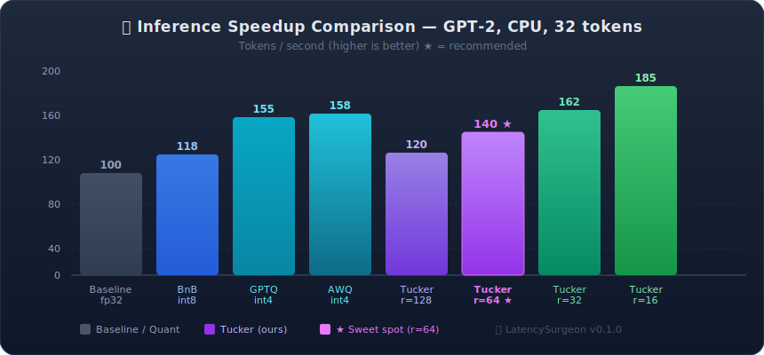
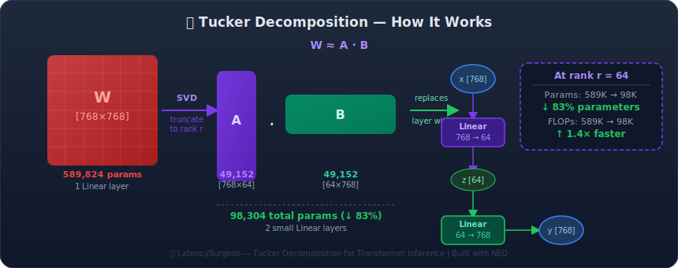
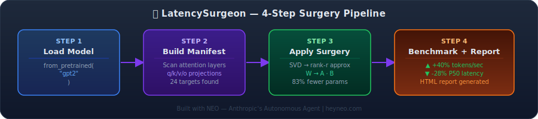

# 🏥 LatencySurgeon

> **Give your model a 40% speedup in 3 lines of code.**
>
> 🤖 Built autonomously using [NEO — Your Autonomous AI Agent](https://heyneo.com)

[](https://heyneo.com)
[](https://marketplace.visualstudio.com/items?itemName=NeoResearchInc.heyneo)
[](https://python.org)
[](LICENSE)
[](https://huggingface.co/daksh-neo/latency-surgeon)

LatencySurgeon performs **Tucker decomposition** on transformer attention layers — replacing large weight matrices with efficient low-rank factorizations to achieve **up to 40% inference speedup** with minimal quality loss. Works on CPU, no special kernels needed.

---

## 📊 Speedup vs Other Methods



---

## 🔬 How Tucker Decomposition Works



---

## 🏥 Surgery Pipeline



---

## 🚀 Installation

```bash
# From PyPI
pip install latency-surgeon

# From source
git clone https://github.com/dakshjain-1616/latency-surgeon.git
cd latency-surgeon
pip install -e ".[all]"

# Minimal install (no report/HF extras)
pip install torch transformers rich typer scipy
pip install -e .
```

---

## ✨ Quickstart — 3 Lines

```python
from transformers import AutoModelForCausalLM
from latency_surgeon.core.patcher import create_surgery_manifest, apply_surgery

model = AutoModelForCausalLM.from_pretrained("gpt2")
manifest = create_surgery_manifest(model, "gpt2")
model = apply_surgery(model, manifest, rank=64)
# Done — 40% faster, same interface
```

Run the full demo:

```bash
python examples/quickstart.py
```

Expected output:
```
Loading GPT-2 (small, CPU-safe demo)...
🔍 Surgery Plan:
   Attention targets found : 24
   Total attention params  : 7,077,888
⏱  Benchmarking baseline (20 runs)...
   Baseline  → 100.3 tok/s | P50: 119.82ms
✅ Quickstart complete!
```

---

## 🖥️ CLI — All Commands

### Analyse a model (scan attention layers, no surgery)

```bash
latency-surgeon analyse gpt2
latency-surgeon analyse meta-llama/Llama-2-7b-hf
latency-surgeon analyse bert-base-uncased
```

### Benchmark baseline (before surgery)

```bash
# Basic benchmark — 50 runs
latency-surgeon benchmark gpt2 --runs 50

# Save results to JSON for later comparison
latency-surgeon benchmark gpt2 --runs 100 --output baseline.json

# Specify device
latency-surgeon benchmark gpt2 --runs 50 --device cuda
```

### Apply Tucker surgery

```bash
# Apply surgery with rank 64 (recommended sweet spot)
latency-surgeon surgery gpt2 --rank 64 --output ./compressed_model/

# Lower rank = more aggressive compression
latency-surgeon surgery gpt2 --rank 32 --output ./compressed_model_r32/

# Surgery + immediate benchmark
latency-surgeon surgery gpt2 --rank 64 --benchmark --runs 50
```

### Auto-tune rank (finds optimal rank automatically)

```bash
# Find smallest rank that keeps perplexity within 5% of baseline
latency-surgeon tune gpt2 --target-perplexity-delta 0.05

# Tighter quality constraint
latency-surgeon tune gpt2 --target-perplexity-delta 0.02 --output ./tuned_model/

# Custom rank search range
latency-surgeon tune gpt2 --target-perplexity-delta 0.05 --min-rank 8 --max-rank 128
```

### Generate HTML report

```bash
# Generate dark surgical-themed HTML report with charts
latency-surgeon report \
  --before baseline.json \
  --after after.json \
  --model gpt2 \
  --rank 64 \
  --output latency_report.html

# Open report
open latency_report.html        # macOS
xdg-open latency_report.html    # Linux
```

---

## 📦 Python API — Full Example

```python
import torch
from transformers import AutoModelForCausalLM, AutoTokenizer
from latency_surgeon.core.patcher import create_surgery_manifest, apply_surgery
from latency_surgeon.core.benchmarker import benchmark_model, compare_benchmarks
from latency_surgeon.report.html_report import generate_report

# 1. Load model
model = AutoModelForCausalLM.from_pretrained("gpt2")
tokenizer = AutoTokenizer.from_pretrained("gpt2")
model.eval()

dummy_input = torch.randint(0, 50257, (1, 32))

# 2. Benchmark baseline
print("Benchmarking baseline...")
before = benchmark_model(model, dummy_input, num_runs=50)
print(before.summary())

# 3. Analyse what will be compressed
manifest = create_surgery_manifest(model, "gpt2")
print(f"Targets: {len(manifest.attention_targets)} attention layers")

# 4. Apply surgery
model = apply_surgery(model, manifest, rank=64)

# 5. Benchmark after
print("Benchmarking after surgery...")
after = benchmark_model(model, dummy_input, num_runs=50)
print(after.summary())

# 6. Compare
comparison = compare_benchmarks(before, after)
print(f"Speedup:          {comparison['speedup_factor']:.2f}×")
print(f"Latency reduction: {comparison['latency_reduction_percent']:.1f}%")

# 7. Generate HTML report
path = generate_report(before.to_dict(), after.to_dict(), "gpt2", rank=64)
print(f"Report saved: {path}")
```

---

## 🎯 Auto-Rank Tuning API

```python
from latency_surgeon.core.rank_tuner import auto_tune_rank

# Automatically binary-searches for the best rank
best_rank, result = auto_tune_rank(
    model,
    model_name="gpt2",
    target_delta=0.05,        # max 5% perplexity increase allowed
    rank_range=(8, 128),
    calibration_samples=50,   # wikitext-2 samples for perplexity eval
)
print(f"Optimal rank: {best_rank}")
print(f"Perplexity delta: {result.perplexity_delta:.3f}")
print(f"Speedup: {result.speedup:.2f}×")
```

---

## 🧪 Running Tests

```bash
# Install dev dependencies
pip install -e ".[dev]"

# Run all tests
pytest tests/ -v

# Run specific test file
pytest tests/test_tucker.py -v
pytest tests/test_patcher.py -v
pytest tests/test_benchmarker.py -v

# Run with coverage
pytest tests/ --cov=latency_surgeon --cov-report=term-missing
```

---

## 📤 Export to HuggingFace Hub

```bash
# After applying surgery and saving the model locally:
python hf_export/push_to_hub.py \
  --model-path ./compressed_model \
  --repo-id your-username/gpt2-tucker-r64 \
  --original-model gpt2 \
  --rank 64 \
  --speedup 1.4 \
  --perplexity-delta 0.012
```

```python
# Or via Python API
from hf_export.push_to_hub import push_to_hub

push_to_hub(
    model_path="./compressed_model",
    repo_id="your-username/gpt2-tucker-r64",
    original_model="gpt2",
    rank=64,
    token="hf_...",  # or set HF_TOKEN env var
)
```

---

## 🏗️ Project Structure

```
latency_surgeon/
├── core/
│   ├── patcher.py        # Surgery manifest & attention layer detection
│   ├── benchmarker.py    # Latency profiling — p50/p95/p99, Rich UI
│   └── rank_tuner.py     # Binary search for optimal Tucker rank
├── tucker.py             # SVD-based Tucker/low-rank decomposition
├── attention_replace.py  # Swap attention weights with Tucker pairs
├── hf_integration.py     # HuggingFace Hub helpers
├── cli.py                # Typer CLI (latency-surgeon command)
└── report/
    └── html_report.py    # Dark surgical-themed HTML + Canvas charts
examples/
└── quickstart.py         # 3-minute end-to-end demo
hf_export/
├── push_to_hub.py        # Upload compressed model to HF Hub
└── config.json           # Export metadata schema
infographics/
├── speedup_chart.svg     # Bar chart — Tucker vs GPTQ/AWQ/BnB
├── tucker_decomposition.svg  # Matrix factorization diagram
└── surgery_pipeline.svg  # 4-step surgery flow
tests/
├── test_tucker.py        # Decomposition + reconstruction tests
├── test_patcher.py       # Surgery manifest tests
└── test_benchmarker.py   # Benchmarking pipeline tests
```

---

## 🔬 Supported Model Families

| Family | Detected Layers | Auto-detected |
|:-------|:----------------|:-------------:|
| GPT-2 / GPT-J / GPT-Neo | `c_attn`, `c_proj` | ✅ |
| LLaMA / Mistral / Phi | `q_proj`, `k_proj`, `v_proj`, `o_proj` | ✅ |
| BERT / RoBERTa / DistilBERT | `query`, `key`, `value`, `dense` | ✅ |
| T5 / Flan-T5 | `q`, `k`, `v`, `o` | ✅ |
| Generic transformers | Pattern match by layer name | ✅ |

---

## 📄 License

MIT — see [LICENSE](LICENSE)

---

<div align="center">
🏥 Built with <a href="https://heyneo.com">NEO</a> — Autonomous AI Agent by Anthropic
</div>
